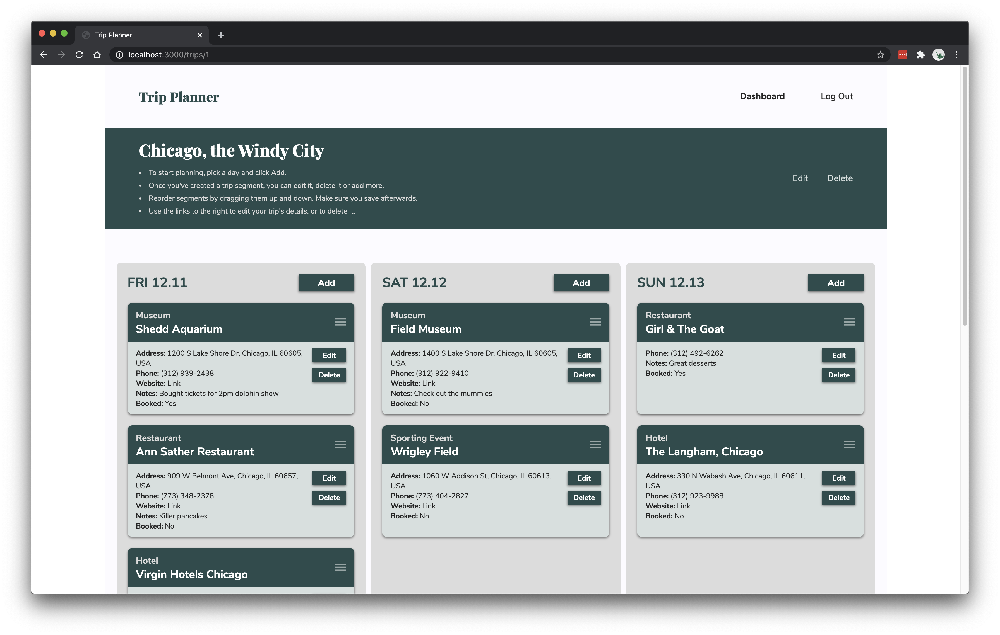

# Trip Planner

> 

### An app for creating quick, easy-to-edit itineraries

Trip Planner is a product of my own passion for travel prep. As soon as I make the decision to travel somewhere, I start a list of things I want to see and do when I arrive. This list is based on recommendations I receive from friends, guide books and other sources, like the internet, and it usually ends up in a spreadsheet. As the list evolves, I clumsily copy and paste items from one cell to another, in an attempt to organize the content I collected and build some resemblance of an itinerary. While I enjoy putting these travel mood boards/schedules together, doing so sucks up a lot of time, and I always felt like should be a better tool to use than a basic spreadsheet.

That's where Trip Planner comes in. It's a straight-forward app that allows users to create an account, add trips to it, then fill those trips with all the recommendations they collect. The app does more than store information, though. It also gives users the ability to group recommendations by day, then easily reorder them, providing users with an instant itinerary. As more recommendations, or "segments", are added, users can continue to drag them around, until the optimal itinerary is crafted.

---

## Technology Used

Trip Planner is a full-stack app, built primarily using Node, Express.js and Sequelize. Utilized languages include HTML, CSS, JavaScript, EJS and SQL.

As a Node/Express app, Trip Planner takes advantage of the node package `express-ejs-layouts` to handle the app's various layouts and controllers. Routes are overseen by two controllers: `auth.js`, which handles user authorization, and `trips.js`, which handles client requests, as well as requests to the database. The app consists of three primary pages, or views, which include `index.ejs`, `dashboard.ejs` and `trips.ejs`. Interactivty is managed by several scripts: `app.js` handles events and event listeners, `drag-drop.js` provides drag-and-drop functionality and `api.js` configures the Google Places API and initializes its autocomplete feature.

In addition to the inclusion of the Google Places API, I pulled from the GSAP library ([GreenSock](https://greensock.com/gsap/)) to create the app's drag-and-drop feature.

---

## Planning

Initial planning for the app consisted of three elements: wireframes, user stories and an entity relationship diagram (ERD) for mapping out the structure of the database.

### Wireframes


### User Stories

- Who: travelers who like to plan their trips in advance; organized and disorganized travelers alike
- What: an easy way to record potential trip plans—dinner at a restaurant, for example—and see if and how they fit into your schedule
- Why: trip planning can be overwhelming, because you need to keep track of a lot of details while remaining flexible. Many modern travelers would benefit from a way to jot down each and every idea they get, while also being able to shift those ideas around until a feasible schedule has been created. Ultimately, these travelers just want to get the most out of their trips.

### ERD


<!-- ---

## How to Play

Instructions for using the project and playing the game are included below, as well as within the game itself.

1. After opening the game, click `Pick Your Mystery Person` to be assigned your Mystery Person and start the game. You will see your Mystery Person on the left side of the window.

> 

2. You get to ask a question first. Click on the black-bordered rectangles at the bottom to access dropdown menus that will enable you to craft your question. Depending on what feature you ask about, a third dropdown menu may appear, allowing you to make your question more specific.

> 

3. Once you've built your question, click `Ask Question` to submit it. After some pondering, the computer will answer it with a "Yes" or a "No", seen in the speech bubble in the bottom-right corner.

> 

4. Use the computer's response to mark-off any people who couldn't be the computer's Mystery Person. Do this by simply clicking on their face. When you're ready to move on, click `Next Question` at the bottom.

> 

5. The computer will now ask you a question. Reference your Mystery Person's image in the top-left corner, and respond by clicking either `Yes` or `No`.

> 

6. Once the computer has processed your response, it will either say, "Okay", or it will try and guess your Mystery Person. If it says, "Okay", click `Next Question` to ask your question, and repeat steps 2–6. If it makes a guess, the game will end.

> 

7. Whenever you're ready to guess the computer's Mystery Person, select their name from the dropdown menu on the right side of the window and click `Guess`. The game will end and a message will appear, letting you know if your guess was correct.

> 

8. Click `Pick Another Person` to play again.

> 

---

## How the Game Works

The game is primarily composed of four distinct events:

1. The user (player 1) asks a question.

2. The computer (player 2) responds.

3. The computer asks a question.

4. The user responds.

These events loop until either the user submits a guess, or the computer filters its list of possible solutions down to one. Each event requires its own function, which are explained below.

| Event                        | Functions                                                                  | What Happens                                                                                                                                                                                                                                                                                                                                                                                                                                                                                                                                                                                                                                                                                                  |
| ---------------------------- | -------------------------------------------------------------------------- | ------------------------------------------------------------------------------------------------------------------------------------------------------------------------------------------------------------------------------------------------------------------------------------------------------------------------------------------------------------------------------------------------------------------------------------------------------------------------------------------------------------------------------------------------------------------------------------------------------------------------------------------------------------------------------------------------------------- |
| The user asks a question     | `handleSelectQuestionType`, `handleSelectFeature`, `handleSelectAdjective` | Given that this is the first version of the game, the question-asking process is pretty controlled. Eventually, I'd like to allow the user to type out any question they want, but for now, the user "builds" their question using dropdown menus populated with values from `people.js`. This prevents the user from asking a question that the computer won't understand. One dropdown contains all of the features the user can ask about, while a second contains adjectives related to those features (Note: not all features have adjectives).                                                                                                                                                          |
| The computer responds        | `handleAsk`                                                                | Once the user builds their question and clicks `Ask Question`, the chosen feature and adjective (if selected) are recorded and compared to the object containing the computer's Mystery Person data. Depending on whether the chosen words align with that object, the computer responds with a "Yes" or "No".                                                                                                                                                                                                                                                                                                                                                                                                |
| The computer asks a question | `handleNext1`, `checkForValidQuestion`, `displayQuestion`                  | The computer keeps track of its possible solutions with the `possibilities` array, which at the start of a game, contains objects for every character. As the user responds to the computer's questions, the computer filters this array. The `checkForValidQuestion` function looks through the current state of `possibilities` and chooses a feature, or a feature and an adjective, that aligns with one of the remaining objects. It also chooses the feature that will filter out the greatest percentage of objects, allowing the computer to arrive at a solution faster. Once the optimal feature is chosen, the `displayQuestion` function displays the computer's completed question for the user. |
| The user responds            | `handleResponse`                                                           | The user responds to the computer's question by clicking `Yes` or `No`. The computer then filters `possibilties` based on the response. If the array has more than one object after being filtered, the four-event process restarts, and the user is allowed to ask another question. However, if there's only one object left, the computer immediately stops the game and announces the solution.                                                                                                                                                                                                                                                                                                           |

In addition to the four key events and their functions, there are a number of other functions that contribute to the game's interactivity. A few of the primary ones are listed below.

| Function              | What it Does                                                                                |
| --------------------- | ------------------------------------------------------------------------------------------- |
| `assignMysteryPerson` | Randomly assigns a character to the user and the computer                                   |
| `clearGameboard`      | Visually resets the gameboard between key events                                            |
| `handleGuess`         | Compares the selected character to the computer's Mystery Person, determining a win or loss |
| `handlePlayAgain`     | Resets key data, such as the `possibilities` array, as well as visual elements              |
| `fadePerson`          | Fades and unfades character faces                                                           |
| `toggleInstructions`  | Hides and shows the instructions                                                            |

---

## Installation

Instructions for accessing the project's working files on your local computer are included below.

1. Fork a copy of the game's repository [here.](https://github.com/delayedaa/guess-who.git)

2. Clone the copy to your local computer by typing the following code in your terminal:

```
git clone https://github.com/delayedaa/guess-who.git
```

3. To open the project, navigate to the cloned directory and open `index.html` in your browser by typing the following code in your terminal:

```
open index.html
```

---

## Credits

Thanks to `Vector_Vision` for the character illustrations. You can access more of their work on [Adobe Stock.](https://stock.adobe.com/contributor/206040275/vector-vision?load_type=author&prev_url=detail) -->
