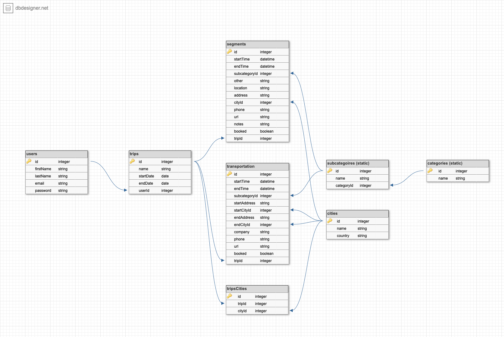
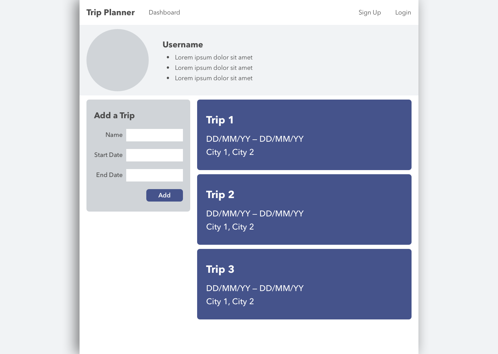
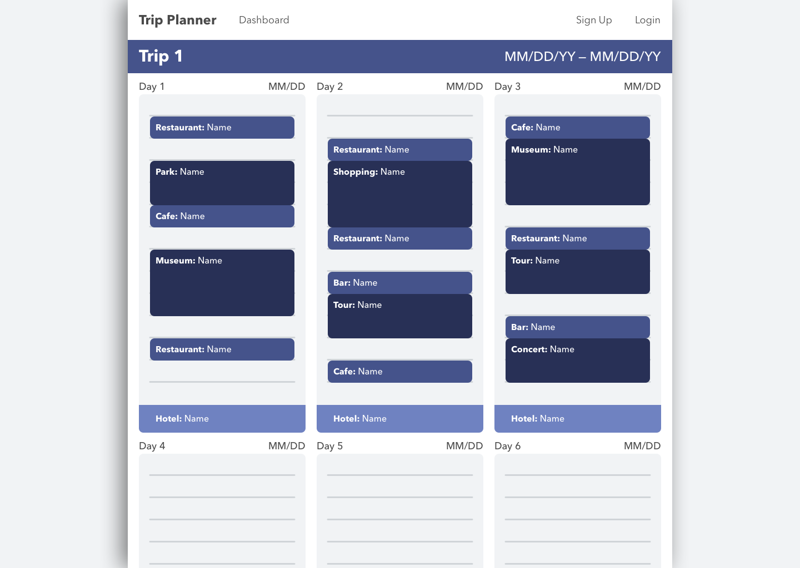
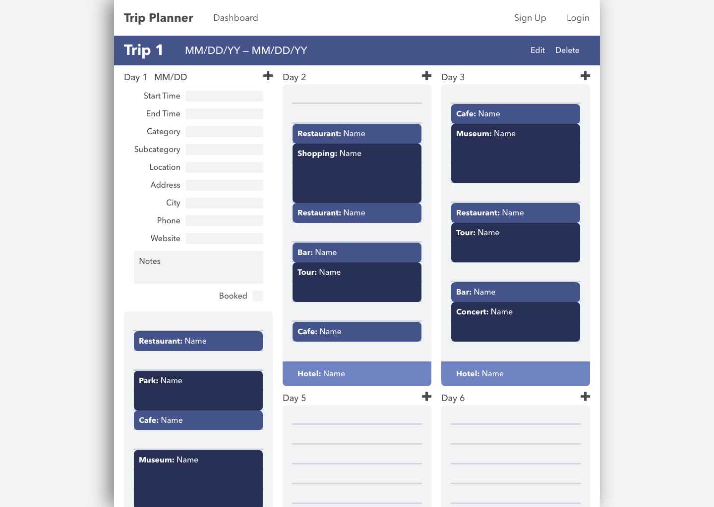

# Trip Planner
GA Project 2 | Trip-planning app

## ERD

## User Stories
- Who: travelers who like to plan their trips in advance; organized and disorganized travelers alike
- What: an easy way to record potential trip plans—dinner at a restaurant, for example—and see if and how they fit into your schedule
- Why: trip planning can be overwhelming, because you need to keep track of a lot of details while remaining flexible. Many modern travelers would benefit from a way to jot down each and every idea they get, while also being able to shift those ideas around until a feasible schedule has been created. Ultimately, these travelers just want to get the most out of their trips.

## Wireframes

